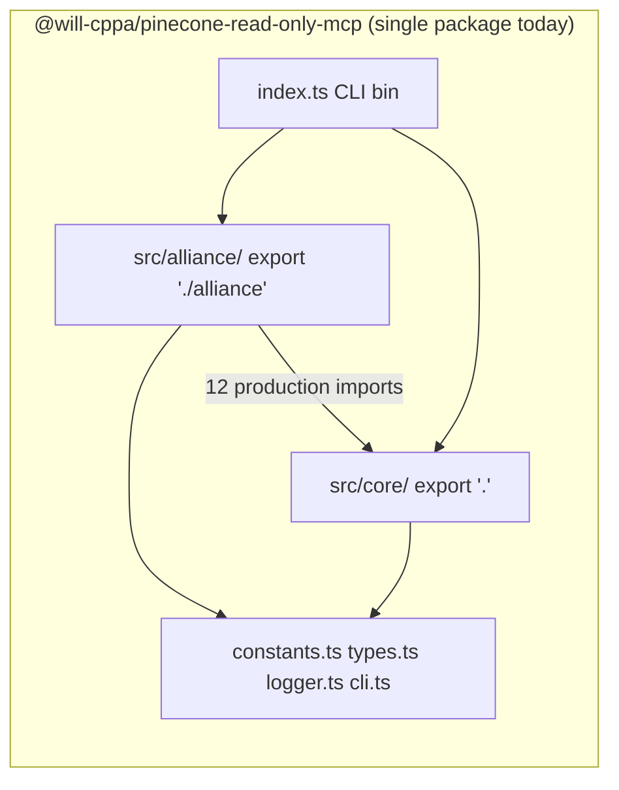

# Core / Alliance package split evaluation

## Executive summary

| Question                                        | Answer                                                                                                                                                                                                                           |
| ----------------------------------------------- | -------------------------------------------------------------------------------------------------------------------------------------------------------------------------------------------------------------------------------- |
| Can core and alliance be separate npm packages? | **Yes, technically feasible.** Production dependency is one-way (`alliance` → `core`); no circular imports.                                                                                                                      |
| Which consumers use which layer?                | **Alliance layer:** CLI, MCP client configs, Alliance examples, internal C++ Alliance deployments. **Core layer:** generic embedders, core-only setup, shared types/errors. No known external community consumers yet (pre-1.0). |
| Recommended package structure                   | **npm workspace monorepo** in this repository (not separate git repos) if/when the split proceeds.                                                                                                                               |
| **Decision**                                    | **Split later** — after phase 5 legacy-getter deprecation completes and one deprecation window has elapsed. Keep the unified package until then.                                                                                 |

The source boundary (`src/core/` vs `src/alliance/`) is already clean enough to become a package boundary. The remaining blockers are public API surface (legacy module facades still exported from core), build/workspace tooling (not yet present), and low external adoption incentive while the project is still pre-1.0.

---

## 1. Problem statement

The eval describes generic MCP infrastructure and Alliance-specific URL generators, server instructions, and tools shipping in a single npm package `@will-cppa/pinecone-read-only-mcp`. The closed extension surface finding (T23) notes that adding namespace-specific URL patterns, new MCP tools, or custom response transformations requires source modification — a barrier to adoption by non-Alliance consumers.

Evaluating a package split determines whether the **core MCP bridge** (generic, stable) and the **Alliance app layer** (domain-specific, iterating) should decouple their release cadences so that Alliance-only changes stop forcing shared version bumps across the non-test source tree.

This document evaluates whether to make that boundary an **npm package** boundary.

---

## 2. Current architecture snapshot

### 2.1 Single package, dual export conditions

Today one package publishes two entry points via `package.json` `exports`:

| Export         | Build output             | Surface                                                                                                                                          |
| -------------- | ------------------------ | ------------------------------------------------------------------------------------------------------------------------------------------------ |
| `"."`          | `dist/core/index.js`     | 7 core MCP tools, `ServerContext`, `setupCoreServer`, `resolveConfig`, URL registry API, shared types                                            |
| `"./alliance"` | `dist/alliance/index.js` | Re-exports all of core **plus** `setupAllianceServer`, `resolveAllianceConfig`, `guided_query`, `suggest_query_params`, Boost/Slack URL builtins |

The CLI binary (`pinecone-read-only-mcp` → `dist/index.js`) is a thin composition root that always wires the Alliance path: `resolveAllianceConfig` → `createServer` → `setupAllianceServer`.

### 2.2 Source layout

| Layer       | Location                                                          | Non-test `.ts` lines (approx.) | Role                                                                                                       |
| ----------- | ----------------------------------------------------------------- | ------------------------------ | ---------------------------------------------------------------------------------------------------------- |
| Core        | `src/core/`                                                       | ~3,250                         | Generic MCP–Pinecone bridge: 7 tools, `ServerContext`, formatters, caches, suggestion engine, URL registry |
| Alliance    | `src/alliance/`                                                   | ~600                           | Alliance config defaults, 2 extra tools, mailing/Slack URL builtins, `setupAllianceServer`                 |
| Shared root | `src/constants.ts`, `types.ts`, `logger.ts`, `cli.ts`, `index.ts` | ~670                           | Instructions constants, shared types, logging, CLI parsing                                                 |

**Total non-test source:** ~4,500 lines (issue eval cited ~2,800; count has grown with ServerContext phases and tests are excluded here).

### 2.3 Dependency direction



**Production code:** `src/alliance/` imports from `src/core/`; `src/core/` does **not** import from `src/alliance/`.

**Test-only reverse imports** (4 files under `src/core/`):

- `src/core/setup-multi-instance.test.ts`
- `src/core/setup-guards.test.ts`
- `src/core/server.test.ts`
- `src/core/server/redaction.test.ts`

These are manageable in a split (move to an integration test package or add `@will-cppa/pinecone-read-only-mcp-alliance` as a devDependency of core tests).

### 2.4 Alliance-specific surface today

| Artifact       | Location                       | Alliance-specific content                                                                                               |
| -------------- | ------------------------------ | ----------------------------------------------------------------------------------------------------------------------- |
| URL generators | `src/alliance/url-builtins.ts` | `mailing`, `slack-Cpplang` namespace patterns                                                                           |
| MCP tools      | `src/alliance/tools/`          | `guided_query`, `suggest_query_params`                                                                                  |
| Config         | `src/alliance/config.ts`       | Defaults: index `rag-hybrid`, rerank `bge-reranker-v2-m3`, suggest-flow gate on                                         |
| Setup          | `src/alliance/setup.ts`        | Delegates to `setupCoreServer`, then registers builtins + Alliance tools                                                |
| Instructions   | `src/constants.ts`             | `ALLIANCE_SERVER_INSTRUCTIONS` = `CORE_SERVER_INSTRUCTIONS` + Alliance appendix; deprecated `SERVER_INSTRUCTIONS` alias |

Core setup uses `CORE_SERVER_INSTRUCTIONS` (7 tools). Alliance setup uses `ALLIANCE_SERVER_INSTRUCTIONS` (9 tools).

### 2.5 What is already decoupled

Phases 1–4 of the ServerContext roadmap established:

- Per-instance `ServerContext` with URL registry, suggest-flow gate, namespaces cache, and client slot
- All 9 tool handlers accept optional `ctx`
- `setupCoreServer({ context? })` and `setupAllianceServer({ context? })` support multi-instance embedding without `teardownServer()` between setups
- `src/core/index.ts` documents core as the generic programmatic entrypoint; `src/alliance/index.ts` re-exports core for Alliance consumers

The **source** boundary is production-ready. The **npm** boundary is not yet implemented.

---

## 3. Technical feasibility

### 3.1 Verdict: feasible with moderate build-tooling work

Separating core and alliance into distinct npm packages is **technically feasible** because:

1. **Acyclic dependency graph** — Alliance depends on core; core never depends on Alliance in production code.
2. **Clear ownership** — Core owns generic tools and infrastructure; Alliance owns domain config, builtins, and two orchestration tools.
3. **Existing export split** — Consumers already import from `"."` vs `"./alliance"`; a package split mostly changes _where those paths resolve_, not embedder mental models.

### 3.2 Files that must move or be split

| File / module      | Current use                                   | Recommended owner if split                                                                      |
| ------------------ | --------------------------------------------- | ----------------------------------------------------------------------------------------------- |
| `src/core/**`      | Core package body                             | `@will-cppa/pinecone-read-only-mcp` (keep name)                                                 |
| `src/alliance/**`  | Alliance package body                         | `@will-cppa/pinecone-read-only-mcp-alliance` (new name)                                         |
| `src/types.ts`     | Shared response/query types                   | Core (Alliance imports from core)                                                               |
| `src/logger.ts`    | Structured logging, redaction                 | Core (Alliance imports from core)                                                               |
| `src/constants.ts` | Mixed: `CORE_*` and `ALLIANCE_*` instructions | Split: core constants in core package; Alliance appendix + deprecated alias in Alliance package |
| `src/cli.ts`       | CLI flag parsing                              | Alliance package (CLI is Alliance-default) or shared thin CLI package (not recommended)         |
| `src/index.ts`     | CLI entry (`bin`)                             | Alliance package                                                                                |

A third micro-package for logging or types alone is **not recommended** — it adds publish/CI overhead without meaningful decoupling benefit.

### 3.3 Import changes at package boundary

Today `src/alliance/index.ts` does:

```ts
export * from '../core/index.js';
```

After a split this becomes a real npm dependency:

```ts
export * from '@will-cppa/pinecone-read-only-mcp';
```

All relative `../core/...` imports inside Alliance become package imports. TypeScript project references or path mapping in a workspace root `tsconfig.json` support local development linking.

### 3.4 Build and workspace tooling gap

The repository is a **single-package** npm project today. No `pnpm-workspace.yaml`, `lerna.json`, `nx.json`, or `turbo.json` exists.

A split requires:

| Work item                                                                    | Effort     |
| ---------------------------------------------------------------------------- | ---------- |
| Root `package.json` workspaces (`"workspaces": ["packages/*"]`)              | Low        |
| Per-package `package.json`, `tsconfig.json`, build scripts                   | Medium     |
| CI: lint, test, coverage, and publish per package (or orchestrated via root) | Medium     |
| `vitest` config spanning workspace packages                                  | Low–medium |
| npm publish: two packages, version coordination policy                       | Medium     |

Estimated implementation effort for the split itself: **~3–5 days** (not including phase 5 API cleanup or consumer migration docs).

### 3.5 Public API blockers (must resolve before split)

The core public API (`src/core/index.ts`) still exports **legacy module facades** that delegate to `getDefaultServerContext()`:

- `setPineconeClient`
- `registerUrlGenerator`, `unregisterUrlGenerator`, `generateUrlForNamespace`, `hasUrlGenerator`

These are Alliance-era singleton patterns. Publishing them as the stable surface of a standalone "generic core" package would cement the wrong contract. **Phase 5** deprecates and eventually removes these exports, leaving `ServerContext` + setup APIs as the supported public contract.

Until phase 5 completes, "core" is generic in _source layout_ but not yet generic in _published API_.

### 3.6 Extension surface (T23) and package split

A package split **alone** does not open the extension surface. Today, adding a new namespace URL pattern or MCP tool still requires forking or patching source — whether that source lives in one package or two.

What a split **does** enable:

- Non-Alliance consumers depend only on core and never pull Alliance builtins or tools
- Alliance can ship faster without bumping core version for unrelated core stability fixes
- Clearer ownership for contributions (generic vs domain-specific)

Plugin/registry APIs for third-party URL generators and tools remain a separate roadmap item beyond this evaluation.

---

## 4. Consumer impact assessment

### 4.1 Consumer matrix

| Consumer                                         | Layer used                         | Import / deploy path                           | Impact if split                                                                             |
| ------------------------------------------------ | ---------------------------------- | ---------------------------------------------- | ------------------------------------------------------------------------------------------- |
| **Alliance CLI** (default npm install, Docker)   | Alliance                           | `bin: pinecone-read-only-mcp` → Alliance setup | Transparent if bin moves to Alliance package; MCP configs update package name only          |
| **MCP clients** (Cursor, Claude Desktop, etc.)   | Alliance via CLI                   | `npx @will-cppa/pinecone-read-only-mcp@…`      | Config changes to Alliance package name; behavior unchanged                                 |
| **Programmatic Alliance embedders**              | Alliance (+ core re-export)        | `@will-cppa/pinecone-read-only-mcp/alliance`   | Can keep ergonomic re-export from Alliance package; must align Alliance ↔ core semver range |
| **Core-only embedders**                          | Core only                          | `@will-cppa/pinecone-read-only-mcp`            | **No breaking change** if core keeps the existing package name and `"."` export             |
| **Alliance examples** (`examples/alliance/`)     | Alliance                           | `setupAllianceServer`, `resolveAllianceConfig` | Update imports to Alliance package; examples already document instance-first setup          |
| **Quickstart examples** (`examples/quickstart/`) | Core or Alliance depending on demo | Mixed                                          | Per-example migration                                                                       |
| **Internal C++ Alliance deployments**            | Alliance                           | Production MCP configs in README               | Track Alliance package version; core bumps only when needed                                 |
| **Hypothetical external generic consumers**      | Core only                          | Not observed yet                               | Primary beneficiaries of split — avoid Alliance defaults and builtins                       |

### 4.2 Adoption and risk window

- **Pre-1.0**, semver 0.y.z — breaking changes are expected; migration cost is acceptable if documented.
- **No known external community consumers** at time of writing — impact is mostly internal (CppAlliance tooling, eval fixtures, documented embed recipes).
- **Highest-risk change:** MCP client configs that pin `@will-cppa/pinecone-read-only-mcp` for `npx` would need to pin the Alliance package (or a meta-package shim).

### 4.3 Version cadence motivation

Today a single version covers:

- Core infrastructure changes (formatters, `ServerContext`, hybrid query paths)
- Alliance-only changes (new Slack URL pattern, `guided_query` decision trace, suggest-flow defaults)

After a split, an Alliance-only fix could release as `@will-cppa/pinecone-read-only-mcp-alliance@0.2.1` without bumping core. That decoupling is the **primary business motivation** for the split — but it only matters once multiple consumers with different needs exist or release velocity diverges.

### 4.4 Consumer recommendation during transition

If split proceeds later, publish a **compatibility period**:

1. Continue publishing unified `@will-cppa/pinecone-read-only-mcp` as a meta-package that depends on pinned core + Alliance versions (optional shim, one minor cycle).
2. Document migration in `MIGRATION.md`: core users unchanged; Alliance users add explicit Alliance dependency.
3. Deprecate `./alliance` subpath export on the unified package name before removing it.

---

## 5. Proposed package structure

### 5.1 Option A: npm workspace monorepo (recommended if splitting)

Keep one git repository; add workspace packages:

```text
pinecone-read-only-mcp-typescript/
  package.json                 # workspace root (private)
  packages/
    core/                      # @will-cppa/pinecone-read-only-mcp
      package.json
      tsconfig.json
      src/
        core/                    # moved from repo src/core/
        types.ts
        logger.ts
        constants.ts             # CORE_SERVER_INSTRUCTIONS only
    alliance/                  # @will-cppa/pinecone-read-only-mcp-alliance
      package.json               # dependencies: @will-cppa/pinecone-read-only-mcp
      tsconfig.json
      src/
        alliance/                # moved from repo src/alliance/
        constants.ts             # ALLIANCE_INSTRUCTIONS_APPENDIX, ALLIANCE_SERVER_INSTRUCTIONS
        cli.ts
        index.ts                 # bin entry
```

**Pros:**

- Single repo, shared CI, atomic cross-package PRs
- Core package **retains existing name** — no breaking change for core-only importers
- Alliance package owns CLI `bin` and domain iteration
- Matches existing mental model (`"."` vs Alliance)

**Cons:**

- Workspace tooling and dual publish pipeline to implement
- Semver coordination policy required (Alliance `peerDependencies` or `dependencies` on core)

**Suggested version policy:**

- Core: conservative minors; API stable toward 1.0 after phase 5
- Alliance: faster minors; `dependencies: { "@will-cppa/pinecone-read-only-mcp": "^0.x.0" }` with CI matrix testing latest compatible core

### 5.2 Option B: Separate git repositories

Two repos, two CI pipelines, coordinated releases via tags or a release bot.

**Pros:** Hard package boundary enforcement; independent access control.

**Cons:** High overhead for a small team; every cross-cutting change needs two PRs; harder to keep integration tests green.

**Recommendation:** **Not now.** Revisit if external contributors or divergent release ownership justify the cost.

### 5.3 Option C: Keep unified package (status quo)

Continue with `exports["."]` and `exports["./alliance"]` in one package.

**Pros:** Zero build migration; single version; simplest publish story.

**Cons:** Alliance-only changes always bump the shared version; eval T23 coupling perception remains; core public API still carries legacy facades until phase 5 regardless.

---

## 6. Decision

### Recommended: **Split later** (not now)

Defer the npm package split until **after phase 5 legacy-getter deprecation** has shipped and **one deprecation policy window** has elapsed (see [deprecation-policy.md](./deprecation-policy.md)).

Do **not** implement workspace packages in the current sprint. This PR delivers the evaluation only.

### Rationale

1. **Source boundary is ready; published API is not.** Phases 1–4 cleaned instance-path architecture, but core still exports `setPineconeClient`, global URL registry helpers, and `getDefaultServerContext`. Splitting now would publish those as the long-term "generic core" contract. Phase 5 must finish first.

2. **Low external adoption incentive.** All current consumers are internal or documentation-driven. Shared version bumps are inconvenient but not blocking release velocity today.

3. **Build tooling cost during active pre-1.0 development.** Workspace setup, dual publish, and CI changes distract from ServerContext completion, security hardening, and response contract work.

4. **Subpath exports already deliver most consumer value.** Core-only embedders can `import from '@will-cppa/pinecone-read-only-mcp'` today without pulling Alliance tools at import time. The remaining coupling is versioning and npm install footprint (Alliance code still ships in the tarball).

### Alternatives considered

| Option                        | When it makes sense                                     | Why not now                                                        |
| ----------------------------- | ------------------------------------------------------- | ------------------------------------------------------------------ |
| **Split now**                 | External core-only adopters blocked by Alliance cadence | Legacy facades still in core exports; tooling not ready            |
| **Split with phase 4 only**   | Urgent multi-team release decoupling                    | Phase 5 still required for clean API; no urgent consumer pressure  |
| **Keep unified indefinitely** | Single consumer, stable 1.0 shipped                     | Loses future cadence decoupling; re-evaluate at 1.0 planning       |
| **Split at 1.0**              | Clean semver major for both packages                    | **Preferred target window** — combine with phase 5 removal release |

---

## 7. Prerequisites and trigger checklist

Proceed with Option A (workspace monorepo) when **all** of the following are true:

- [ ] Phase 5 release 1: legacy facades marked `@deprecated` in `src/core/index.ts`
- [ ] Phase 5 release 3 (or agreed 1.0): module-level singleton accessors removed from public exports
- [ ] `src/types.ts` contains only core-shared types; Alliance-specific types live under `src/alliance/`
- [ ] `src/logger.ts` owned by core; Alliance uses core export
- [ ] `constants.ts` split between packages (no Alliance instructions in core tarball)
- [ ] CI pipeline supports workspace install, per-package test, and coordinated publish
- [ ] `MIGRATION.md` documents package names, shim period, and MCP config updates
- [ ] At least one **external** or **multi-team** consumer needs independent Alliance release cadence

**Suggested trigger:** planning for **1.0.0** major release, combining phase 5 removal with package split if checklist is complete.

---

## 8. References

- [MIGRATION.md](./MIGRATION.md) — core vs Alliance embed recipes, `ServerContext` phases
- [TOOLS.md](./TOOLS.md) — 7 core tools vs 9 Alliance tools
- [CONFIGURATION.md](./CONFIGURATION.md) — `resolveConfig` vs `resolveAllianceConfig`
- [deprecation-policy.md](./deprecation-policy.md) — deprecation windows before API removal
- Eval finding T23 — closed extension surface (source modification required for new tools/URL patterns)
- Related source: `src/core/index.ts`, `src/alliance/index.ts`, `src/alliance/setup.ts`, `src/alliance/url-builtins.ts`, `src/constants.ts`
